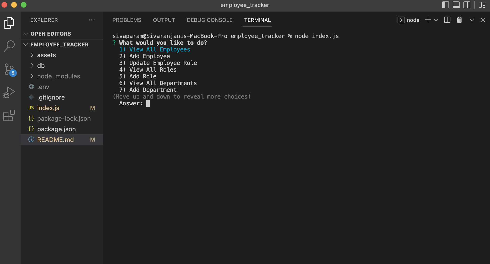
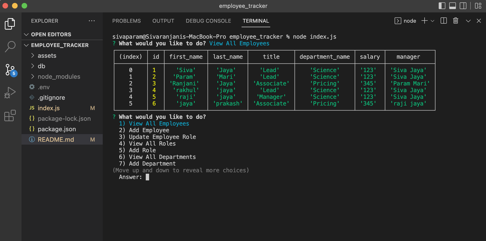
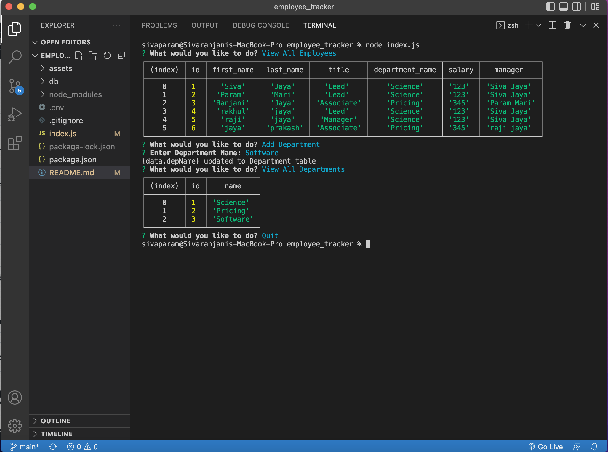

# Employee Tracker 

## Description
* AS a business owner, user would be able to view and manage departments, roles and employees in company, SO THAT owner could organize and plan business.

## Table of contents

-[Description](#description)

-[Acceptance-Criteria](#acceptance-criteria)

-[How to](#how-to)

-[Mock-up screen](#mock-up-screen)

## Acceptance Criteria 

Givan a command-line application that accpets user input, 
WHEN user starts the application, THEN user is presented with the following options:
View all departments, view all roles, view all employees, add a department, add a role, add an employee and update an employee
WHEN user chooses to view all departments, THEN user is presented with a formatted table that shows department names and department ID's
WHEN user chooses to view all roles, THEN user is presented with job title, role id, the department the role belongs to, and the salary for that role
WHEN user chooses to view all employees, THEN user is presented with a formatted table that shows employee data, including employee id, first names, last names, job title, department, salary and managers that the employee reports to
WHEN user chooses to add a department, THEN user is prompted to enter the name of the department and that department is added to the database
WHEN user chooses to add a role, THEN user is prompted to enter the name, salary and department for that role and that role is added to the database
WHEN user chooses to add an employee THEN user is prompted to enter the employee's first name, last name, role and manager and that employee is added to the database
WHEN user chooses to update an employee role, THEN user is prompted to select an employee to update and their new role and is updated to the database

## How to:

* This applciation uses node.js, Inquirer(to get user input), MYSQL(database)

* How to Install: 
npm init
npm i inquirer@8.2.4
Install MYSQL server

* How to Invoke: in command line 'node index.js'

* Future development: Adding validation to user input

\n

## Mock-up screen:

### Github URL: 
https://github.com/Sivaparam/employee_tracker

### Demo of Application:
https://drive.google.com/file/d/13-53TJpPWX-b0wdEB-mhDUlIBiGM7Vhb/view

